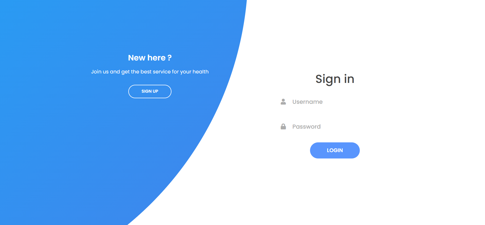
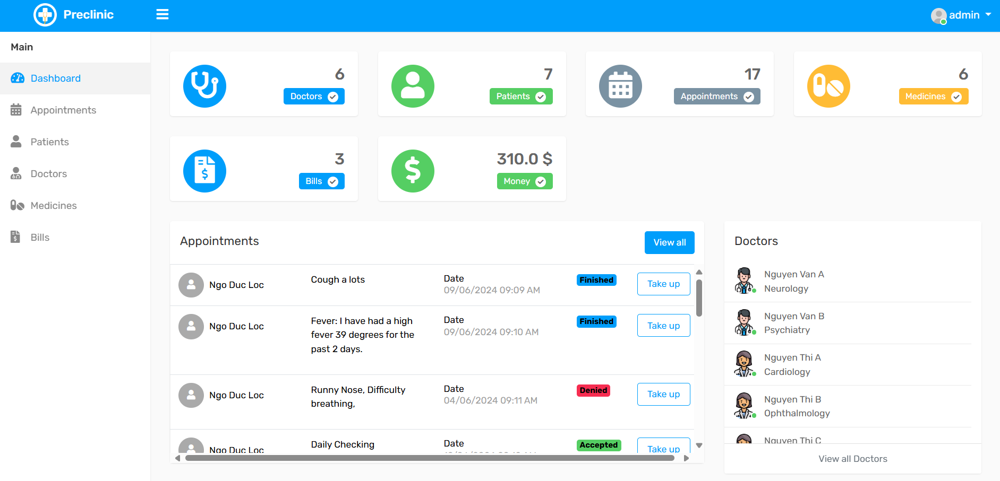

<h1 align="center">Private Clinic Web</h1>

<p align="center">
  
  
  
  
  
</p>

<p align="center">
  
  
</p>

<h2>🏥 Description</h2>
<p>
  Private Clinic Web is a web application for managing a private clinic, developed using Spring Boot and following the MVC (Model-View-Controller) design pattern. This application allows users to manage patient information, appointments, medical records, and various medical services. A MySQL database is used for data storage and is deployed on Azure SQL Database cloud. The application is hosted on Render to ensure scalability and high availability.
</p>

<h2>🌟 Features</h2>
<ul>
  <li><strong>Patient Management:</strong> Add, edit, delete patient</li>
  <li><strong>Appointment Management:</strong> Create, modify, cancel, and view appointments.</li>
  <li><strong>Medical Records Management:</strong> Store and retrieve patient medical information.</li>
  <li><strong>Bill Records Management:</strong> Store and retrieve patient bill information.</li>
  <li><strong>User Authentication and Authorization:</strong> Includes login/registration and role-based access control (doctor, patient, admin).</li>
</ul>

<h2>🛠 Technologies Used</h2>
<ul>
  <li><strong>Backend:</strong> Spring Boot </li>
  <li><strong>Frontend:</strong> Thymeleaf (or any suitable frontend framework) </li>
  <li><strong>Database:</strong> MySQL </li>
  <li><strong>Cloud Database:</strong> Azure SQL Database </li>
  <li><strong>Hosting:</strong> Render </li>
</ul>

<h2>🚀 Installation and Deployment</h2>
<h3>Step 1: Clone this repo</h3></h3>

```bash
git clone https://github.com/VaderNgo/PrivateClinic-Website-Spring-Boot.git
```
<h3>Step 2: Configure the database</h3>

**NOTE: Update the MySQL configuration in the application.properties file.**

```bash
spring.datasource.url=jdbc:mysql://your-database-url
spring.datasource.username=your-username
spring.datasource.password=your-password
```

<h3>Step 3: Run the application (Local) </h3>

<p>In my case, I use Intelliji IDE so just wait for gradle build, then click the Start button</p>

<h3>Step 4: Deploy (Optional)</h3>
<p>Follow the instructions on the <a href="https://render.com/docs/deploy-spring-boot">Render Documentation</a> page to deploy the application.</p>

